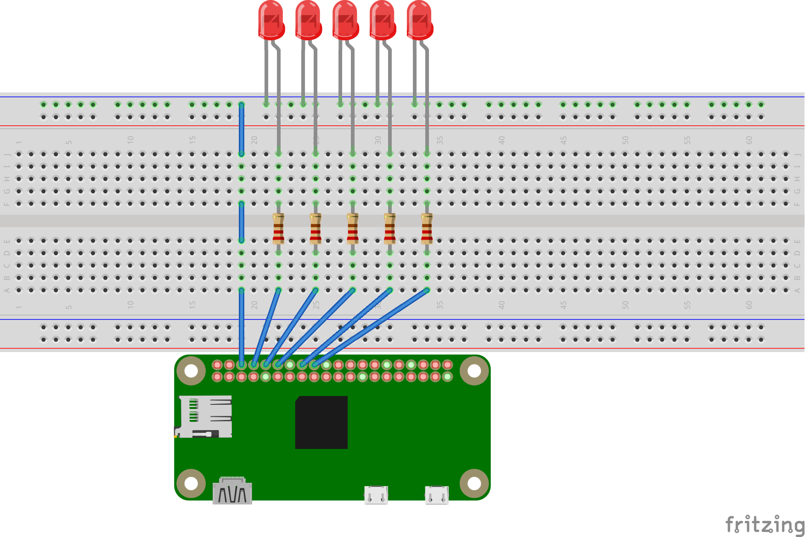

# GPIO
:gear: GPIO Pin control in JS using the gpiochip character device

1. [`Install`](#install)
2. [`Examples`](#example)
3. [`Building`](#building)
4. [`API`](#api)

# Install
AR_GPIO is build on [`fastcall`](https://www.npmjs.com/package/fastcall), which uses cMake instead of node-gyp.  Install cMake before installing AR_GPIO
```
# Install C++ Toolchain
sudo apt-get update
sudo apt-get install build-essential
```
```
sudo apt-get install cmake  # AR_GPIO depends on cmake
```
```
npm i --save https://github.com/shmishtopher/GPIO  # Node dependency
```


# Example

```JavaScript
// Cylon Eyes

const { GPIOChip, OUTPUT, HIGH, LOW } = require('ar_gpio')

const chip = new GPIOChip(0)
const lines = [
  chip.line(14, OUTPUT),
  chip.line(15, OUTPUT),
  chip.line(18, OUTPUT),
  chip.line(23, OUTPUT),
  chip.line(24, OUTPUT)
]

function sleep (ms) {
  return new Promise(resolve => setTimeout(resolve, ms))
}

async function main () {
  while (true) {
    for (let i = 0; i < 4; i++) {
      await sleep(50)
      lines[i + 0].set(LOW) 
      lines[i + 1].set(HIGH)
    }

    for (let i = 4; i > 0; i--) {
      await sleep(50)
      lines[i + 0].set(LOW)
      lines[i - 1].set(HIGH)
    }
  }
}

main()
```

# Building
Building requires the Rust compiler.  The easist way to get RustC and Cargo is with `Rustup`
```
curl https://sh.rustup.rs -sSf | sh -s -- --help
```
With the Rust compiler installed you can build with the NPM script.
```
npm run build
```

# API
Initilize a new GPIOChip:
```JavaScript
/**
 * @param {Number} chip;  The gpio chip to use.  
 * If your gpio chip is at /dev/gpiochip0 then 
 * the `chip` param is `0`
 */

const myChip = new GPIOChip(0)
```

Export a GPIO line:
```JavaScript
/**
 * @param {Number} line;  The BCM pin to export
 * @param {Number} flags;  The flags you need, ORd together
 */

const inputLine = myChip.line(17, INPUT | ACTIVE_LOW)
const outputLine = myChip.line(21, OUTPUT)
```

Read a GPIO line:
```JavaScript
/**
 * The line must be exported as an INPUT before using `.get()`
 * @returns {HIGH | LOW} state;
 */

if (inputLine.get() === HIGH) {
  console.log('Line 17 is HIGH')
}
```

Write to a GPIO line:
```JavaScript
/**
 * The line must be exported as an OUTPUT before using `.set()`
 * @param {HIGH | LOW} state;  The state to set.
 */

outputLine.set(HIGH)
// Or...
outputLine.set(1)


outputLine.set(LOW)
// Or...
outputLine.set(0)
```
